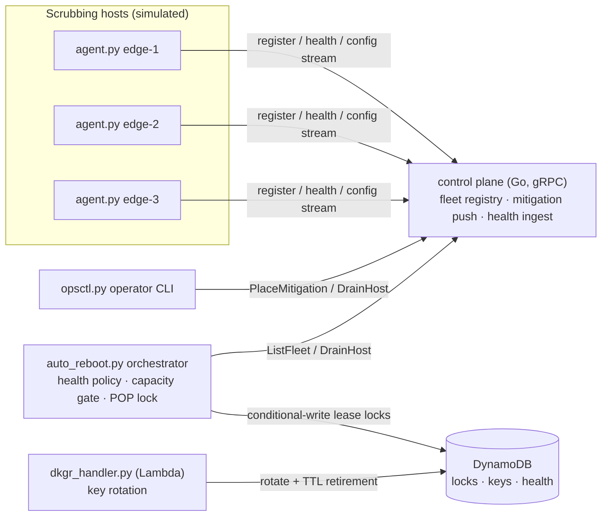
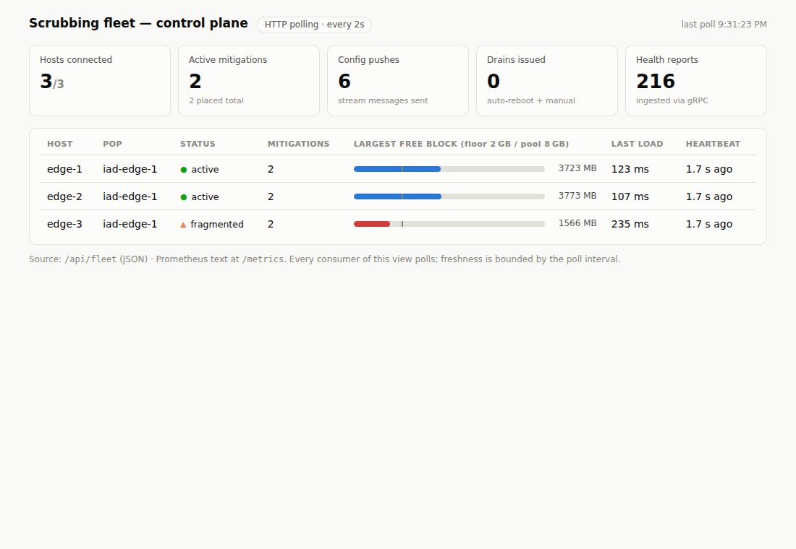

# blackwatch-sim-aws

Simulation of a DDoS **scrubbing-fleet control plane** built on a classic AWS-style
stack — the architecture pattern behind traffic-scrubbing services: a global fleet of
packet-scrubbing hosts that must stay healthy, correctly configured, and safe to
touch while carrying live mitigations.

> **Disclaimer:** educational simulation inspired by *public* descriptions of DDoS
> scrubbing architectures. No proprietary code, internal details, or real traffic
> handling. The "dataplane" is a dict.

A sibling repo, **blackwatch-sim-convex**, rebuilds this exact system on
[Convex](https://convex.dev) to compare the stacks piece by piece.

## Architecture



| Layer | Tech | What it does |
|---|---|---|
| Push pipeline | **Go + gRPC + protobuf** (`control-plane/`) | Fleet registry; replays active mitigations to reconnecting hosts, pushes deltas over server-streaming RPC |
| Host agent | **Python** (`agent/`) | Loads mitigation configs into a simulated dataplane (measured against a 30s load SLA), reports health incl. the fragmentation early-warning `largest_free_block_bytes` |
| Orchestrator | **Python + DynamoDB** (`orchestrator/`) | Auto-reboot with three safety gates: per-POP distributed lease lock (conditional writes + fencing tokens), fleet capacity floor, one-host-per-run blast radius |
| Key rotation | **Python Lambda** (`lambda/`) | DKGR-style datapath key rotation with a PENDING_RETIREMENT grace window reaped by DynamoDB TTL |
| Infra | **CDK (TypeScript)** (`cdk/`) | DynamoDB tables (TTL), the rotation Lambda + EventBridge schedule, S3 health archive |

## Run it

```bash
# prerequisites: go >= 1.24, python3 + `pip install grpcio grpcio-tools`, protoc
make gen build      # protobuf codegen + go build
./scripts/demo.sh   # full lifecycle demo
```

The demo starts the control plane and three agents (edge-3 has a leaky dataplane),
places DROP and THROTTLE mitigations, then runs the orchestrator:

```
[orchestrator] iad-edge-1: draining edge-3 (reason: memory fragmentation:
               largest_free_block=1462MB < floor 2048MB) [fence=1]
[edge-3] REBOOT commanded; draining 2s
[edge-3] rebooted, memory pool reset; re-registering
[edge-3] loaded mit-001 ... largest_free_block=5322MB   <- backlog resync after boot
[orchestrator] fleet healthy, nothing to do
```

Locks default to an in-memory store so the demo needs no AWS credentials; set
`LOCK_TABLE` (and optionally `DDB_ENDPOINT` for DynamoDB Local) to use the real
conditional-write implementation in `orchestrator/locks.py`.

## Observability



The control plane serves an observability sidecar on `-metrics-addr` (default `:8061`):

- **`/metrics`** — Prometheus text format: fleet gauges (`bwsim_hosts_connected`,
  `bwsim_mitigations_active`), counters (`bwsim_config_pushes_total`,
  `bwsim_drains_total`, `bwsim_health_reports_total`), and per-host gauges
  (`bwsim_host_largest_free_block_bytes`, `bwsim_host_config_load_ms`). In
  production the CloudWatch agent scrapes this into the `BwSim/Fleet` namespace.
- **`/api/fleet`** — JSON snapshot backing the dashboard.
- **`/dashboard`** — embedded operator dashboard (light/dark), **polling every 2s**:
  stat tiles, per-host status chips, and largest-free-block meters with the 2 GB
  reboot floor marked. Freshness is bounded by the poll interval — that's the
  point of comparison with the Convex repo.

The Lambda emits **CloudWatch EMF** log lines (`emit_emf` in
`lambda/dkgr_handler.py`) instead of PutMetricData calls, and `cdk/lib/bwsim-stack.ts`
defines a **CloudWatch dashboard** (`bwsim-fleet`): fleet single-values, min
largest-free-block vs the reboot floor, max config-load vs the 30s SLA, and DKGR
rotations vs errors.

## What to look at

- `orchestrator/auto_reboot.py` — the judgment layer: *is this host unhealthy* is the
  easy half; *is it safe to take down right now* is the interesting half.
- `orchestrator/locks.py` — lease locks via DynamoDB conditional writes, with fencing
  tokens against stalled holders.
- `control-plane/server.go` — backlog replay + delta push; a rebooted host converges
  to full mitigation state with no operator involvement.
- `agent/agent.py` — why `largest_free_block_bytes` matters: total free memory can
  look fine while fragmentation makes the next mitigation unloadable.

## Operational costs this stack carries (see the Convex repo for the comparison)

- The push pipeline (registry, streams, backlog replay, reconnect handling) is
  ~300 lines of custom Go that must itself be operated.
- Correctness of locking depends on getting conditional-write semantics right.
- Health state, locks, and keys live in three DynamoDB tables defined in CDK;
  local dev needs DynamoDB Local or mocks.
- Fleet state queries (ListFleet) are point-in-time polls; every consumer that wants
  fresh state has to poll.
